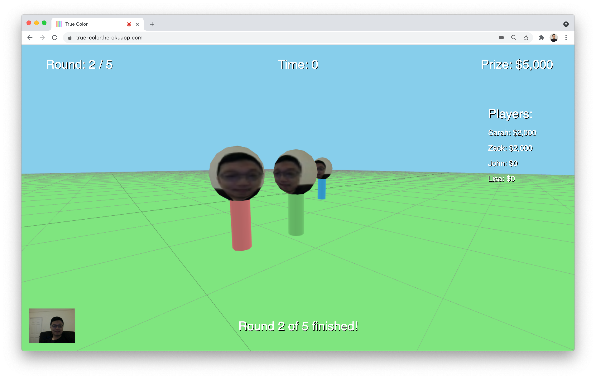

# True Color


## Description
True Color is a 3d multiplayer game where the goal of the game is to match one's own unknown body color to the ground color by talking to other players.

In the game, each player cannot see one's body color because it's a first-person view. So the players need to talk to each other to find out their colors. Players can change their body color by clicking on the mouse button, and after each round, prize money will be distributed to the winners.

Here's the [Live Demo on Heroku](https://true-color.herokuapp.com/). (Requires two or more players to start the game)

## Process & Thoughts
For my final project for the Real Time Social Spaces class, I wanted to create a 3d multiplayer game. And my initial idea was to create a simple 3rd-person multiplayer game called [Battle Square](https://github.com/cuinjune/battle-square) where players can hit each other in 3d space. But later, I thought this isn't fun as a game, and there was no point in sharing the webcam and audio between players because the only important interaction was simply hitting each other. And also, there were already many existing games with similar concepts.

So I started to think about new game ideas, and I wanted to make the conversation between players more meaningful in the game. And I did some research and found some games that heavily depend on social interaction between players including [Among Us](https://store.steampowered.com/app/945360/Among_Us/) and [Party Mafia](https://nuttyparty.com/partymafia). And I also read about [Game Theory](https://www.investopedia.com/terms/g/gametheory.asp) which is a theoretical framework for conceiving social situations among competing players. According to game theory, the actions and choices of all the participants affect the outcome of each. I found this idea interesting so I wanted to create a game that all players can affect each other to get the best result for themselves.

So I came up with the new idea called True Color which is a 3d multiplayer game where the goal of the game is to match one's own unknown body color to the ground color by talking to other players. In the game, each player cannot see one's body color because it's a first-person view. So the players need to talk to each other to find out their colors. And players can change their body color by clicking on the mouse button, and after each round, prize money will be distributed to the winners. What's interesting about this game is that it can be both competitive and collaborative at the same time. Because although the goal of the game is getting the highest prize money among players which means the players need to trick other players, some of the players can sometimes help each other to win against other players.

I created the first version of the game and did some user testing with some of my classmates, and while they seemed to enjoy the game, they gave me some helpful feedback for improvements. First, almost all of them didn't understand how the game works in the beginning, because I showed the instructions while the game is being played, so they could not focus on reading them. And some of them wanted to know if their body color is properly changed after they click the mouse button. And many said 10 rounds of 1-minute each felt too long and can be shorter. So based on their feedback, I updated the app for a better user experience. I made the app show the instructions with a voiceover before the game starts so the users can more focus on the instructions. And now a message appears when each player changes the body color by clicking a mouse button. And I reduced the total number of rounds to 5, and now the time limit of each round depends on the number of players so each round is shorter than before, but more time is given when more players join the game.

In the future, I would like to further work on improving the overall quality of the app including designing the background area by adding objects that players can interact with. And I think these objects can be used to provide some clues for players to guess their body colors.

## Future plans
* Add name labels above each player's head.
* Design the background area. (e.g. walls, boxes)
* Implement how the player interacts with the background objects.
* Implement how players interact with each other.
* Provide some clues using background objects.
* Add background music or ambient sound.

## Setup
1. Installation of node.js is required. Follow [this guide](https://github.com/itp-dwd/2020-spring/blob/master/guides/installing-nodejs.md) to install it.
2. Run the following commands in the Terminal.
```
git clone https://github.com/cuinjune/true-color.git
cd true-color
npm install dependencies
npm start
```
3. Open your web browser and navigate to http://localhost:3000

## Tools & Libraries used
Three.js, Socket.io, WebRTC, Node.js, Express.js

## References
* https://github.com/AidanNelson/threejs-webrtc
* https://github.com/mrdoob/three.js/blob/dev/examples/misc_controls_pointerlock.html

## Reporting bugs
Please post an [issue](https://github.com/cuinjune/true-color/issues) if you face any problem using the app.

## Author
* [Zack Lee](https://www.cuinjune.com/about): MPS Candidate at [NYU ITP](https://itp.nyu.edu).


